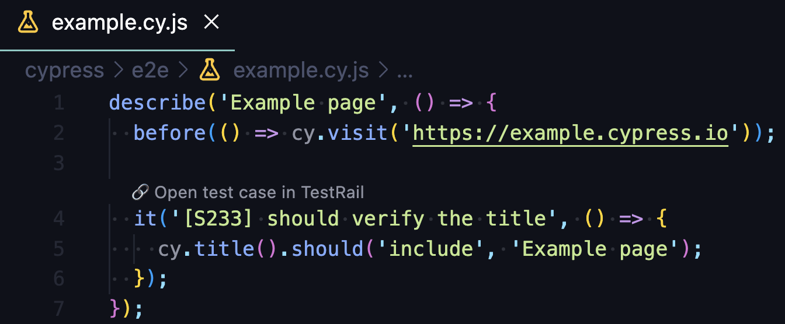

# Doorman

Doorman is a simple, lightweight VSCode extension that allows you to link and open test cases from you favorite test management tool directly in VSCode.


## Features

- Link test cases from your test management tool directly in VSCode
- Open test cases in your default browser
- Supports multiple test management tools
- Supports multiple test case formats

## Extension Settings

This extension contributes the following settings:

- `doorman.configurations`: List of configurations for your test management tools and test case formats
- `doorman.configurations[].title`: Title of the configuration
- `doorman.configurations[].url`: URL of the test management tool
- `doorman.configurations[].testIdPattern`: Regular expression to match test case ID in the test case format

For example:

Your test management tool is TestRail and test case format is `[S123]`. So, your test looks like this:

```js
it('[S123] should verify the title', () => {
  // ...
});
```

Then you can add the following configuration in your `.vscode/settings.json`:

```json
{
  "doorman.configurations": [
    {
      "title": "🔗 Open test case in TestRail",
      "url": "https://testrail.example.com/index.php?/cases/view/S",
      "testIdPattern": "\\[S(\\d+)\\]"
    }
  ]
}
```

After that you will see the following title in the code block:



By clicking on the title you will open the test case in your default browser.

The URL will be generated based on the configuration. In this case it will be `https://testrail.example.com/index.php?/cases/view/S123`.

There is some useful regular expressions for popular test case formats:

- `[S123]` - `\\[S(\\d+)\\]`

```js
it('[S123] should do something', () => {});
```

- `S123` - `S(\\d+)`

```js
it('S123 should do something', () => {});
```

- `S-123` - `S-(\\d+)`

```js
it('S-123 should do something', () => {});
```

- `S_123` - `S_(\\d+)`

```js
it('S_123 should do something', () => {});
```

- `.S123.` - `.S(\\d+)\\.`

```js
it('.S123. should do something', () => {});
```

- `@S-123` - `@S-(\\d+)`

```js
it('@S-123 should do something', () => {});
```

- `:S123:` - `:S(\\d+):`

```js
it(':S123: should do something', () => {});
```

## Author

Yevhen Laichenkov <elaichenkov@gmail.com>